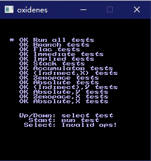
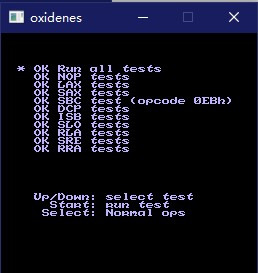

# mos6502

A Interpreter/Disassembler for MOS 6502.

## status

Currently mainly supports Ricoh 2A03,and support for BCD is missing.

Can pass the test of [nestest.nes](http://nickmass.com/images/nestest.nes)

Need more test on non-nes target

## no_std

This crate supports executing in no_std, but disassembly info needs `alloc` to format string.